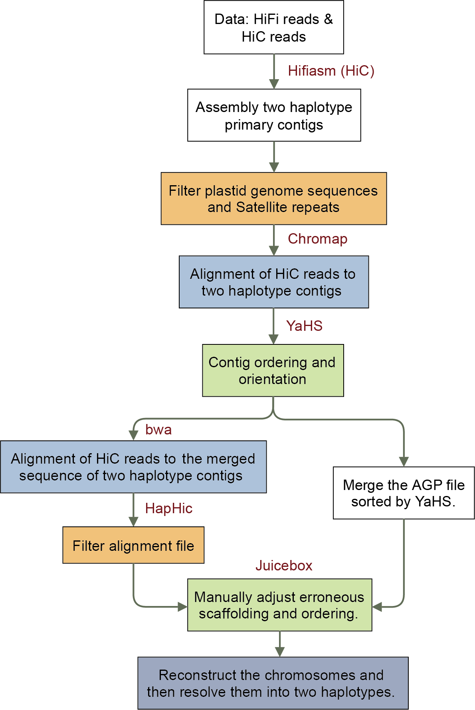

## Haplotype-resolved_Assembly



### 1.参考基因组AM560的组装

```shell
hifiasm -t $threads -o TEST1-MS --primary -l3 --h1 ${Hic_1} --h2 ${Hic_2} --ul $ONT $CCS
```


### 2.其他木薯基因组组装

```shell
hifiasm -t $threads -o TEST1-MS --primary -l3 --h1 ${Hic_1} --h2 ${Hic_2}  $CCS
```


### 3.Contig过滤
Since the initial contig assembly contained plastid genome sequences, we downloaded previously published cassava mitochondrial (MK176513.1) and chloroplast (EU117376.1) genome sequences from NCBI (GCF_001659605.2) and annotated our assembled contigs based on sequence alignment using Minimap2. Contigs predominantly composed of plastid DNA were excluded. Satellite repeats were mainly identified using Jellyfish (v2.3.1) (https://github.com/gmarcais/Jellyfish) with 41-bp K-mers. GC content analysis was also calculated in identifying satellite contigs, as well as contigs with potential assembly algorithm bias or sequencing bias. After these filtering steps, the remaining contigs were used for downstream Hi-C scaffolding.

```
python contig_filter.py draft.contig.fa > contig.fa
```


### 4.单倍型基因组挂载

#### 4.1将HiFiasm的两个phased基因组分别用个体的HiC数据单独挂载

```shell
bash Hic_scaffold_script1_hap1.sh
bash Hic_scaffold_script1_hap2.sh
```

#### 4.2将两个hap的挂载的结果合并到一起重新绘制HiC热图

```shell
bash Hic_scaffold_script1_joint.sh
```

#### 4.3用juicebox手动调整HiC热图

手动调整之后的导出新的结果，根据参考基因组的染色体顺序将两套单倍型分开。
