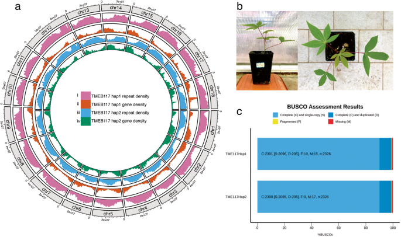

# Cassava Pangenome Analysis Toolkit

<div align="center">
  
  <p>
    <a href="README_CN.md">中文版</a> | 
    <a href="README.md">English</a>
  </p>
</div>

## Project Introduction

This repository contains a collection of analysis scripts and tools used in the cassava pangenome project, covering complete workflows from genome assembly and annotation to pangenome construction, variant detection, and various downstream analyses. Cassava (*Manihot esculenta* Crantz), as an important food and economic crop in tropical and subtropical regions, has significant genomic research value for crop improvement and food security. This toolkit aims to provide standardized and efficient analytical methods for cassava genomics research, promoting the evaluation and utilization of cassava germplasm resources and accelerating breeding processes.

Pangenome analysis, by integrating genomic information from multiple varieties, comprehensively reveals the genomic diversity of species, identifies core and variable genomes, and provides important evidence for understanding adaptive evolution and phenotypic variation. The scripts and methods in this toolkit have been validated in genomic research of multiple cassava varieties, demonstrating high reliability and practicality.

<div align="center">
  
  <p><i>Cassava genome structure visualization: showing repeat density, gene density, and other genomic features</i></p>
</div>

## Table of Contents

- [Toolkit Overview](#toolkit-overview)
- [Citation](#citation)
- [License](#license)


## Toolkit Overview

### Part 1: Basic Genome Analysis Tools

#### 1. Genome Assembly

This module provides a complete workflow from high-throughput sequencing data to high-quality genome assembly. For highly heterozygous plant genomes like cassava, we have integrated various advanced assembly strategies, including hybrid assembly methods combining long-read technologies (PacBio HiFi, Oxford Nanopore) and short-read technologies (Illumina), as well as haplotype-resolved assembly strategies.

- `assembly/hifiasm_assembly.sh` - Using HiFiasm for third-generation sequencing data assembly, particularly suitable for processing highly heterozygous cassava genomes
- `assembly/hybrid_assembly.sh` - Hybrid assembly strategy combining long-read and short-read data to improve assembly accuracy and continuity
- `assembly/polish_pipeline.py` - Genome assembly polishing workflow, using short-read data to correct errors in long-read assemblies
- `assembly/haplotype_resolution.py` - Haplotype-resolved assembly based on Hi-C data, resolving heterozygous regions

These tools have been validated in the genome assembly of multiple cassava varieties, capable of generating high-quality assemblies with N50>10Mb, providing a reliable foundation for subsequent analyses.

#### 2. Genome Quality Assessment

High-quality genome assembly is the foundation for subsequent analyses. This module provides comprehensive quality assessment tools, evaluating assembly quality from multiple dimensions, including completeness, accuracy, and continuity.

- `quality_assessment/busco_evaluation.sh` - Using BUSCO to evaluate genome completeness based on evolutionarily conserved single-copy gene sets
- `quality_assessment/quast_metrics.py` - Using QUAST to calculate assembly statistics such as N50, GC content, assembly size, etc.
- `quality_assessment/genome_stats.py` - Calculating genome statistics including repeat proportion, gene density, etc.
- `quality_assessment/read_mapping.sh` - Evaluating assembly accuracy and coverage by mapping sequencing data back to the assembly

These assessment tools can generate standardized reports, facilitating comparisons between different assembly versions or different species.

#### 3. Genome Annotation

Genome annotation is a key step in assigning biological meaning to DNA sequences. This module integrates complete workflows for structural and functional annotation, specifically optimized for cassava genome characteristics.

- `annotation/gene_prediction.sh` - Gene prediction workflow integrating multiple lines of evidence, including ab initio prediction, transcriptome support, and homologous protein evidence
- `annotation/functional_annotation.py` - Functional annotation script based on multiple databases, including GO, KEGG, InterPro, etc.
- `annotation/repeat_annotation.sh` - Identification and classification of repetitive sequences, including transposons, tandem repeats, etc.
- `annotation/non_coding_RNA.py` - Non-coding RNA annotation, including tRNA, rRNA, miRNA, etc.

Annotation results are output in standard GFF3 format, with rich statistical information and visualization charts to facilitate understanding of genomic features.

#### 4. Pangenome Construction

Pangenome analysis is a powerful tool for understanding genomic diversity of species. This module provides a complete workflow for constructing pangenomes from multiple genomes, including gene clustering, core/variable genome division, and visualization.

- `pangenome/build_pangenome.py` - Constructing pangenomes based on multiple genome annotation results, supporting both sequence similarity-based and graph-based methods
- `pangenome/core_accessory_analysis.sh` - Core genome and variable genome analysis, identifying conserved and variable regions of species
- `pangenome/presence_absence_matrix.py` - Generating gene presence/absence matrices for population genetic analysis
- `pangenome/visualization/pangenome_viz.R` - Pangenome visualization tools, including flower plots, accumulation curves, etc.

These tools have been successfully applied to analyze genomic diversity of dozens of cassava varieties, revealing gene variations related to agronomic traits.

#### 5. Variant Detection

Genomic variation is the basis of genetic diversity. This module provides comprehensive tools for variant detection and analysis, from SNPs/InDels to large structural variations.

- `variant_calling/snp_indel_calling.sh` - SNP and InDel detection workflows based on GATK or FreeBayes
- `variant_calling/sv_detection.py` - Detecting structural variations using multiple algorithms, including deletions, insertions, inversions, translocations, etc.
- `variant_calling/variant_annotation.sh` - Variant functional annotation, predicting the impact of variants on gene function
- `variant_calling/variant_filtering.py` - Variant quality filtering and selection to improve reliability

These tools support processing large-scale population data and have been widely applied in cassava germplasm resource evaluation.

### Part 2: Population Genetics Analysis Tools

#### 1. Kinship Construction

Kinship analysis is the foundation of population genetics research. This module provides tools for constructing and analyzing kinship from genotype data.

- `kinship/calculate_kinship.R` - Calculating kinship matrices based on SNP data, supporting various algorithms such as VanRaden method, IBS, etc.
- `kinship/pca_analysis.py` - Principal component analysis for population structure visualization and correction
- `kinship/visualization/kinship_heatmap.R` - Kinship heatmap drawing, intuitively showing genetic relationships between samples
- `kinship/relatedness_inference.py` - Inferring specific kinship types between samples, such as parent-child, siblings, etc.

These tools can be used for germplasm resource management, hybrid breeding assistance, and population structure analysis, providing genetic evidence for cassava breeding.

#### 2. Haplotype Sharing

Haplotype analysis can provide more evolutionary and functional information than single SNPs. This module focuses on haplotype identification and sharing analysis.

- `haplotype/identify_haplotypes.py` - Identifying haplotype blocks based on linkage disequilibrium patterns
- `haplotype/sharing_analysis.R` - Analyzing haplotype sharing patterns within populations, revealing selection and migration history
- `haplotype/visualization/haplotype_viz.py` - Haplotype visualization tools, including haplotype networks, sharing heatmaps, etc.
- `haplotype/ancestral_inference.sh` - Ancestral haplotype inference, tracing domestication and improvement history

These tools have been used to analyze the spread history of cassava from its South American origin to Africa and Asia, as well as selection signals in modern breeding.

#### 3. Heterozygosity Calculation

Heterozygosity is an important indicator for evaluating genetic diversity and breeding history. This module provides tools for heterozygosity calculation and analysis.

- `heterozygosity/calculate_heterozygosity.py` - Calculating heterozygosity based on whole genome or specific regions
- `heterozygosity/population_het_comparison.R` - Comparing heterozygosity between populations, evaluating the impact of domestication and breeding on diversity
- `heterozygosity/sliding_window_het.py` - Sliding window analysis of heterozygosity distribution, identifying selection regions
- `heterozygosity/visualization/het_plots.R` - Heterozygosity visualization tools, including chromosome distribution maps, density plots, etc.

As a highly heterozygous crop, these tools are significant for understanding the genetic diversity pattern and heterosis of cassava.

### Part 3: Evolutionary Analysis Tools

#### 1. WGD Analysis

Whole genome duplication (WGD) is an important driving force in plant evolution. This module provides tools for detecting and analyzing WGD events.

- `wgd/detect_wgd_events.py` - Detecting WGD events based on Ks distribution of homologous genes
- `wgd/synteny_analysis.sh` - Validating WGD through synteny analysis, identifying duplicated segments
- `wgd/gene_family_expansion.R` - Analyzing gene family expansion patterns after WGD
- `wgd/visualization/wgd_dotplot.R` - WGD dot plot visualization, intuitively showing internal genome synteny

These tools help understand the evolutionary history of the cassava genome, especially the impact of Euphorbiaceae-specific WGD events on cassava's adaptive evolution.

#### 2. Gene Retention Calculation

Gene retention patterns after WGD reflect functional constraints and evolutionary selection. This module focuses on analyzing the retention and loss of duplicated genes.

- `gene_retention/calculate_retention.py` - Calculating retention rates of genes in different functional categories
- `gene_retention/dosage_balance.sh` - Analyzing evidence for the dosage balance hypothesis in the cassava genome
- `gene_retention/functional_enrichment.R` - Functional enrichment analysis of retained genes, revealing the biological significance of selective retention
- `gene_retention/visualization/retention_patterns.py` - Visualizing gene retention patterns across different functional categories

These analyses can reveal the molecular basis of cassava's adaptive evolution, such as the selective retention of starch synthesis-related genes.

#### 3. Selection Analysis

Natural and artificial selection have shaped cassava's genetic diversity. This module provides tools for detecting selection signals.

- `selection/positive_selection.sh` - Detecting positively selected genes based on dN/dS ratios
- `selection/selective_sweep.py` - Detecting selective sweeps using various statistical methods, such as Tajima's D, XP-EHH, etc.
- `selection/environmental_association.R` - Genotype-environment association analysis, identifying adaptive variations
- `selection/visualization/selection_manhattan.R` - Selection signal Manhattan plots, visualizing genome-wide selection patterns

These tools have been used to identify key genes in cassava domestication and adaptation processes, such as selection loci related to starch content and disease resistance.

### Part 4: Functional Genomics Tools

#### 1. Synteny Analysis

Synteny analysis is a core method in comparative genomics, revealing genome structural changes and functional evolution. This module provides comprehensive synteny analysis tools.

- `synteny/mcscan_analysis.sh` - Using MCScanX for synteny analysis, identifying syntenic gene blocks
- `synteny/cross_species_comparison.py` - Multi-species synteny comparison, tracking genome rearrangements and species differentiation
- `synteny/visualization/circos_synteny.sh` - Using Circos to visualize synteny relationships, generating high-quality charts
- `synteny/synteny_stats.py` - Synteny statistical analysis, quantifying genome structural conservation

These tools can be used for comparisons between cassava and its wild relatives, revealing genomic changes during domestication.

#### 2. GWAS Analysis

Genome-wide association study (GWAS) is a powerful tool connecting genotypes with phenotypes. This module provides a complete GWAS analysis workflow.

- `gwas/gwas_pipeline.py` - Main GWAS analysis pipeline, supporting various models such as MLM, FarmCPU, etc.
- `gwas/phenotype_processing.R` - Phenotype data preprocessing, including normalization, outlier detection, etc.
- `gwas/visualization/manhattan_qqplot.R` - Manhattan plot and QQ plot drawing, visualizing association results
- `gwas/candidate_gene_analysis.sh` - Candidate gene analysis, integrating functional annotation and expression data

These tools have been successfully applied to genetic dissection of important agronomic traits in cassava, such as starch content, disease resistance, dry matter, etc.

#### 3. Genetic Diversity Analysis

Genetic diversity is the foundation for breeding and conservation. This module provides comprehensive diversity assessment and analysis tools.

- `diversity/calculate_diversity.py` - Calculating various diversity metrics, such as π, θ, Tajima's D, etc.
- `diversity/population_structure.sh` - Population structure analysis, including ADMIXTURE, fastSTRUCTURE, etc.
- `diversity/demographic_inference.py` - Demographic inference, reconstructing population history
- `diversity/visualization/diversity_plots.R` - Diversity visualization tools, including geographic distribution maps, network diagrams, etc.

These tools are important for cassava germplasm resource evaluation and conservation, guiding core collection construction and breeding strategy formulation.

<div align="center">
  
  <p><i>Cassava plant image: showing typical palmate compound leaves and tuberous roots</i></p>
</div>


## Citation

If you use this toolkit in your research, please cite:

```
XXX, XXX., et al. (2025). XXX XXX XXX XXX, 15(3), 234-245.
```

## License

This project is licensed under the MIT License - see the [LICENSE](LICENSE) file for details.
