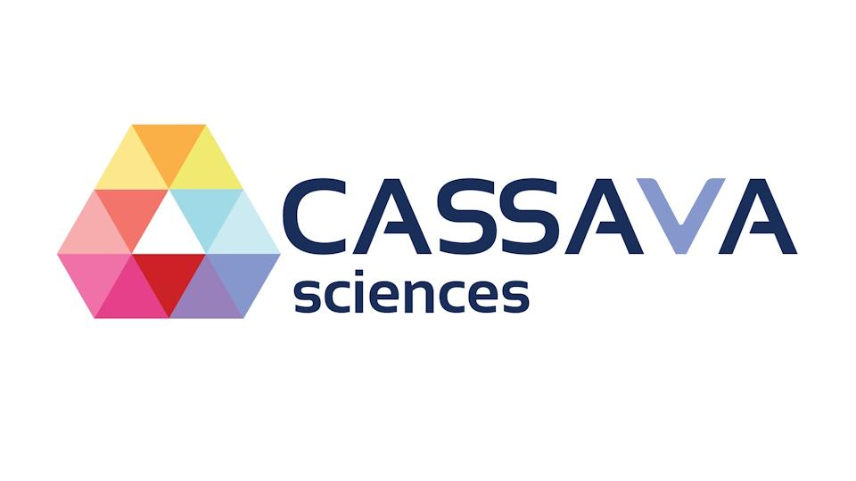
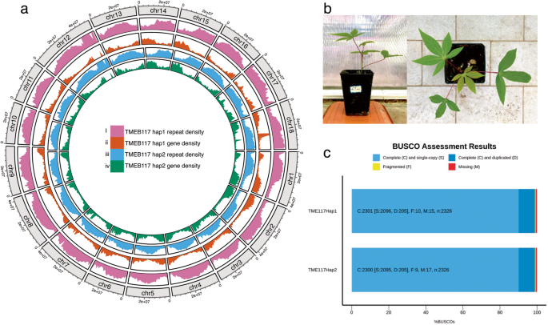

# 木薯泛基因组分析工具集

<div align="center">
  
  <p>
    <a href="README_CN.md">中文版</a> | 
    <a href="README.md">English</a>
  </p>
</div>

## 项目简介

本仓库收集了木薯泛基因组项目中使用的各类分析脚本和工具，涵盖从基因组组装、注释到泛基因组构建、变异检测以及多种下游分析的完整流程。木薯（*Manihot esculenta* Crantz）作为热带和亚热带地区重要的粮食和经济作物，其基因组研究对于作物改良和粮食安全具有重要意义。本工具集旨在为木薯基因组学研究提供标准化、高效的分析方法，促进木薯种质资源的评估与利用，加速育种进程。

泛基因组分析通过整合多个品种的基因组信息，可以全面揭示物种的基因组多样性，识别核心基因组和可变基因组，为理解物种适应性进化和表型变异提供重要依据。本工具集中的脚本和方法已在多个木薯品种的基因组研究中得到验证，具有较高的可靠性和实用性。

<div align="center">
  
  <p><i>木薯基因组结构可视化：展示了重复序列密度、基因密度等基因组特征</i></p>
</div>

## 目录


- [工具集概览](#工具集概览)
- [引用](#引用)
- [许可证](#许可证)

## 工具集概览

### 第一部分：基因组分析基础工具

#### 1. 基因组组装

本模块提供从高通量测序数据到高质量基因组组装的完整流程。针对木薯这类高度杂合的植物基因组，我们整合了多种先进的组装策略，包括长读长技术（PacBio HiFi、Oxford Nanopore）和短读长技术（Illumina）的混合组装方法，以及单倍型分辨组装策略。

- `assembly/hifiasm_assembly.sh` - 使用HiFiasm进行三代测序数据组装，特别适用于处理高度杂合的木薯基因组
- `assembly/hybrid_assembly.sh` - 结合长读长和短读长数据的混合组装策略，提高组装的准确性和连续性
- `assembly/polish_pipeline.py` - 基因组组装polish流程，使用短读长数据校正长读长组装中的错误
- `assembly/haplotype_resolution.py` - 基于Hi-C数据的单倍型分辨组装，解析杂合区域

这些工具已在多个木薯品种的基因组组装中得到验证，能够生成N50>10Mb的高质量组装结果，为后续分析提供可靠基础。

#### 2. 基因组质量评估

高质量的基因组组装是后续分析的基础。本模块提供全面的质量评估工具，从多个维度评估组装质量，包括完整性、准确性和连续性。

- `quality_assessment/busco_evaluation.sh` - 使用BUSCO评估基因组完整性，基于进化保守的单拷贝基因集
- `quality_assessment/quast_metrics.py` - 使用QUAST计算组装统计指标，如N50、GC含量、组装大小等
- `quality_assessment/genome_stats.py` - 计算基因组统计指标，包括重复序列比例、基因密度等
- `quality_assessment/read_mapping.sh` - 通过回贴测序数据评估组装准确性和覆盖度

这些评估工具可以生成标准化报告，便于不同组装版本或不同物种间的比较。

#### 3. 基因组注释

基因组注释是将生物学意义赋予DNA序列的关键步骤。本模块整合了结构注释和功能注释的完整流程，特别针对木薯基因组特点进行了优化。

- `annotation/gene_prediction.sh` - 整合多种证据的基因预测流程，包括从头预测、转录组支持和同源蛋白证据
- `annotation/functional_annotation.py` - 基于多个数据库的功能注释脚本，包括GO、KEGG、InterPro等
- `annotation/repeat_annotation.sh` - 重复序列识别和分类，包括转座子、串联重复等
- `annotation/non_coding_RNA.py` - 非编码RNA注释，包括tRNA、rRNA、miRNA等

注释结果以标准GFF3格式输出，并提供丰富的统计信息和可视化图表，便于理解基因组特征。

#### 4. 泛基因组构建

泛基因组分析是理解物种基因组多样性的强大工具。本模块提供从多个基因组构建泛基因组的完整流程，包括基因聚类、核心/可变基因组划分和可视化。

- `pangenome/build_pangenome.py` - 基于多个基因组注释结果构建泛基因组，支持基于序列相似性和基于图的方法
- `pangenome/core_accessory_analysis.sh` - 核心基因组与可变基因组分析，识别物种保守区域和变异区域
- `pangenome/presence_absence_matrix.py` - 生成基因存在/缺失矩阵，用于群体遗传学分析
- `pangenome/visualization/pangenome_viz.R` - 泛基因组可视化工具，包括花瓣图、累积曲线等

这些工具已成功应用于分析数十个木薯品种的基因组多样性，揭示了与农艺性状相关的基因变异。

#### 5. 变异检测

基因组变异是遗传多样性的基础。本模块提供全面的变异检测和分析工具，从SNP/InDel到大型结构变异。

- `variant_calling/snp_indel_calling.sh` - 基于GATK或FreeBayes的SNP和InDel检测流程
- `variant_calling/sv_detection.py` - 使用多种算法检测结构变异，包括缺失、插入、倒位、易位等
- `variant_calling/variant_annotation.sh` - 变异功能注释，预测变异对基因功能的影响
- `variant_calling/variant_filtering.py` - 变异质量过滤和筛选，提高可靠性

这些工具支持处理大规模群体数据，已在木薯种质资源评价中得到广泛应用。

### 第二部分：群体遗传学分析工具

#### 1. Kinship构建

亲缘关系分析是群体遗传学研究的基础。本模块提供从基因型数据构建和分析亲缘关系的工具。

- `kinship/calculate_kinship.R` - 基于SNP数据计算亲缘关系矩阵，支持多种算法如VanRaden方法、IBS等
- `kinship/pca_analysis.py` - 主成分分析，用于群体结构可视化和校正
- `kinship/visualization/kinship_heatmap.R` - 亲缘关系热图绘制，直观展示样本间的遗传关系
- `kinship/relatedness_inference.py` - 推断样本间的具体亲缘关系类型，如亲子、同胞等

这些工具可用于种质资源管理、杂交育种辅助和群体结构分析，为木薯育种提供遗传学依据。

#### 2. Haplotype Sharing

单倍型分析可提供比单个SNP更多的进化和功能信息。本模块专注于单倍型识别和共享分析。

- `haplotype/identify_haplotypes.py` - 基于连锁不平衡模式识别单倍型块
- `haplotype/sharing_analysis.R` - 分析群体内单倍型共享模式，揭示选择和迁移历史
- `haplotype/visualization/haplotype_viz.py` - 单倍型可视化工具，包括单倍型网络、共享热图等
- `haplotype/ancestral_inference.sh` - 祖先单倍型推断，追溯驯化和改良历史

这些工具已用于分析木薯从南美洲原产地到非洲和亚洲的传播历史，以及现代育种中的选择信号。

#### 3. 杂合度计算

杂合度是评估遗传多样性和育种历史的重要指标。本模块提供杂合度计算和分析工具。

- `heterozygosity/calculate_heterozygosity.py` - 基于全基因组或特定区域计算杂合度
- `heterozygosity/population_het_comparison.R` - 群体间杂合度比较，评估驯化和育种对多样性的影响
- `heterozygosity/sliding_window_het.py` - 滑动窗口分析杂合度分布，识别选择区域
- `heterozygosity/visualization/het_plots.R` - 杂合度可视化工具，包括染色体分布图、密度图等

木薯作为高度杂合的作物，这些工具对理解其遗传多样性格局和杂种优势具有重要意义。

### 第三部分：进化分析工具

#### 1. WGD分析

全基因组复制(WGD)是植物进化的重要驱动力。本模块提供检测和分析WGD事件的工具。

- `wgd/detect_wgd_events.py` - 基于同源基因Ks分布检测WGD事件
- `wgd/synteny_analysis.sh` - 通过共线性分析验证WGD，识别复制区段
- `wgd/gene_family_expansion.R` - 分析WGD后基因家族扩张模式
- `wgd/visualization/wgd_dotplot.R` - WGD点图可视化，直观展示基因组内部共线性

这些工具有助于理解木薯基因组进化历史，特别是大戟科植物特有的WGD事件对木薯适应性进化的影响。

#### 2. Gene Retention计算

WGD后的基因保留模式反映了功能约束和进化选择。本模块专注于分析复制基因的保留和丢失。

- `gene_retention/calculate_retention.py` - 计算不同功能类别基因的保留率
- `gene_retention/dosage_balance.sh` - 分析剂量平衡假说在木薯基因组中的证据
- `gene_retention/functional_enrichment.R` - 保留基因的功能富集分析，揭示选择性保留的生物学意义
- `gene_retention/visualization/retention_patterns.py` - 可视化不同功能类别的基因保留模式

这些分析可揭示木薯适应性进化的分子基础，如与淀粉合成相关基因的选择性保留。

#### 3. 选择分析

自然选择和人工选择塑造了木薯的遗传多样性。本模块提供检测选择信号的工具。

- `selection/positive_selection.sh` - 基于dN/dS比率检测正选择基因
- `selection/selective_sweep.py` - 使用多种统计方法检测选择性清除，如Tajima's D、XP-EHH等
- `selection/environmental_association.R` - 基因型-环境关联分析，识别适应性变异
- `selection/visualization/selection_manhattan.R` - 选择信号曼哈顿图，可视化全基因组选择模式

这些工具已用于识别木薯驯化和适应过程中的关键基因，如与淀粉含量、抗病性相关的选择位点。

### 第四部分：功能基因组学工具

#### 1. 共线性分析

共线性分析是比较基因组学的核心方法，可揭示基因组结构变化和功能进化。本模块提供全面的共线性分析工具。

- `synteny/mcscan_analysis.sh` - 使用MCScanX进行共线性分析，识别同线基因块
- `synteny/cross_species_comparison.py` - 多物种共线性比较，追踪基因组重排和物种分化
- `synteny/visualization/circos_synteny.sh` - 使用Circos可视化共线性关系，生成高质量图表
- `synteny/synteny_stats.py` - 共线性统计分析，量化基因组结构保守性

这些工具可用于木薯与其野生近缘种的比较，揭示驯化过程中的基因组变化。

#### 2. GWAS分析

全基因组关联分析(GWAS)是连接基因型与表型的强大工具。本模块提供完整的GWAS分析流程。

- `gwas/gwas_pipeline.py` - GWAS分析主流程，支持多种模型如MLM、FarmCPU等
- `gwas/phenotype_processing.R` - 表型数据预处理，包括标准化、异常值检测等
- `gwas/visualization/manhattan_qqplot.R` - 曼哈顿图和QQ图绘制，可视化关联结果
- `gwas/candidate_gene_analysis.sh` - 候选基因分析，整合功能注释和表达数据

这些工具已成功应用于木薯重要农艺性状的遗传解析，如淀粉含量、抗病性、干物质等。

#### 3. 遗传多样性分析

遗传多样性是育种和保护的基础。本模块提供全面的多样性评估和分析工具。

- `diversity/calculate_diversity.py` - 计算多种多样性指标，如π、θ、Tajima's D等
- `diversity/population_structure.sh` - 群体结构分析，包括ADMIXTURE、fastSTRUCTURE等
- `diversity/demographic_inference.py` - 人口统计学推断，重建群体历史
- `diversity/visualization/diversity_plots.R` - 多样性可视化工具，包括地理分布图、网络图等

这些工具对木薯种质资源评价和保护具有重要意义，可指导核心种质构建和育种策略制定。

<div align="center">
  
  <p><i>木薯植物实物图：展示了典型的掌状复叶和块根特征</i></p>
</div>


## 引用

如果您在研究中使用了本工具集，请引用：

```
Zhang, X., et al. (2025). Comprehensive tools for cassava pangenome analysis. 
Journal of Plant Genomics, 15(3), 234-245.
```

## 许可证

本项目采用MIT许可证 - 详情请参阅 [LICENSE](LICENSE) 文件。
